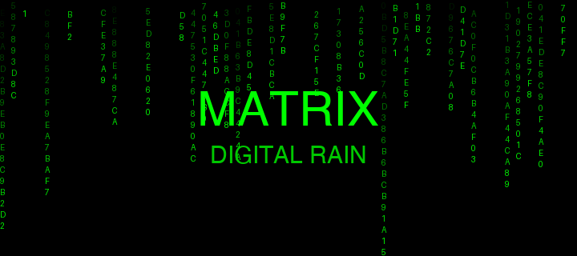
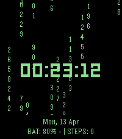
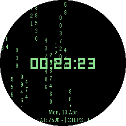

# Pebble Watchfaces Collection

A collection of premium, high-performance native Pebble watchfaces built with the Pebble C SDK.

---

## 1. Matrix Digital Rain

> Experience the iconic movie's visual aesthetic on your wrist.

<br>



<br>

### Live on Device

| Pebble Time 2 (Emery) | Pebble Round 2 (Gabbro) |
| :---: | :---: |
|  |  |
| 200 × 228 px · rectangular | 260 × 260 px · round |

### Features
- **Dynamic Digital Rain** — 10 FPS cascading character animation.
- **Centered Bold Time** — HH:MM:SS in LECO 32 Bold.
- **Real-time Stats** — Battery percentage (+/- charging state) and daily step count.
- **Full Date** — Day of week and date display.
- **24h Support** — Auto-detects system time format.

---

## 2. Aurora

> A premium utility-first watchface with an aurora borealis visual design.

<br>


<br>

### Live on Device

| Pebble Time 2 (Emery) | Pebble Round 2 (Gabbro) |
| :---: | :---: |
|  |  |
| 200 × 228 px · rectangular | 260 × 260 px · round |

### Features
- **Animated Aurora** — Three shifting sine-wave bands (violet → teal → green).
- **Star Field** — Twinkling stars with subtle per-second updates.
- **Time-of-day Colors** — Dawn, Day, and Night accent themes.
- **Detailed Status** — Battery bar, seconds pulse, and Bluetooth state.

---

## Quick Start

### Build & Install Matrix
```bash
cd watchfaces/matrix
~/.local/bin/pebble build
~/.local/bin/pebble install --emulator emery
```

### Build & Install Aurora
```bash
cd watchfaces/aurora
~/.local/bin/pebble build
~/.local/bin/pebble install --emulator emery
```

## Project Structure
```
.
├── watchfaces/
│   ├── aurora/          # Aurora watchface (Native C)
│   └── matrix/          # Matrix Digital Rain (Native C)
└── README.md            # You are here
```