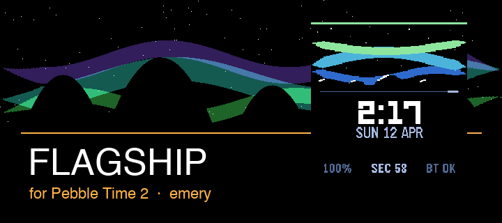
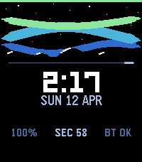
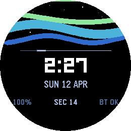

# Flagship — Pebble Watchface

> A premium utility-first watchface with an aurora borealis visual design.
> Built for the **Spring 2026 Pebble Watchface Contest**.

<br>




<br>

### Live on device

| Pebble Time 2 &nbsp;·&nbsp; `emery` | Pebble Round 2 &nbsp;·&nbsp; `gabbro` |
| :---: | :---: |
|  |  |
| 200 × 228 px · rectangular | 260 × 260 px · round |

<br>

## What It Does

Flagship surfaces the information you actually glance at — time, date, battery, and connection — inside a layered aurora landscape that shifts with the time of day.

- **Animated aurora** — three sine-wave bands (violet → teal → green) that flow in real time
- **Star field** with subtle per-second twinkling
- **Mountain silhouette** with snow caps on rectangular displays
- **Second-sweep pulse** — an accent line that travels across the divider each minute
- **Time-of-day accent colours** — amber at morning, sky blue by day, cool violet at night
- **Full status row** — battery %, live seconds, Bluetooth state
- **12 h / 24 h** — auto-detected from watch settings
- **Both platforms** — Pebble Time 2 (`emery` 200×228) and Pebble Round 2 (`gabbro` 260×260)

<br>

## Quick Start

```bash
cd watchfaces/flagship

# Run unit tests (no Pebble SDK required)
npm test

# Build
pebble build

# Install to emulator
pebble install --emulator emery
pebble install --emulator gabbro
```

<br>

## Architecture

The codebase is split into two layers so the core logic is fully testable without a Pebble SDK or emulator:

```
src/
├── common/          # Pure JS modules — no Pebble APIs, fully unit-tested
│   ├── format.mjs       time, date, battery, Bluetooth formatting
│   ├── layout.mjs       position map for round vs rectangular screens
│   ├── model.mjs        aggregates watch state into a display model
│   └── animation.mjs    derives aurora phase, sweep position from seconds
│
└── embeddedjs/      # Moddable XS — runs on-device via Poco graphics engine
    ├── main.js          rendering engine + event handlers
    └── manifest.json    Moddable module manifest
```

Tests run with the Node.js native test runner — no extra dependencies:

```bash
npm test   # 12 tests, covers format / layout / model / animation
```

<br>

## Rendering Pipeline

Every second (`secondchange` event) the watchface redraws in this order:

1. Black background
2. Star field — twinkling offset cycles every 5 s
3. Aurora bands × 3 — phases driven by `secondProgress` for fluid motion
4. Mountain silhouette + snow caps *(rectangular only)*
5. Accent divider line
6. Second-sweep pulse along divider
7. Time — Leco 42 px LCD digits
8. Meridiem (AM / PM) *(12 h mode only)*
9. Date — compact uppercase `SUN 12 APR`
10. Status row — `100%  ·  SEC 34  ·  BT OK`
11. Battery indicator bar *(top edge, colour-coded)*

<br>

## Project Structure

```
watchfaces/flagship/
├── src/common/          shared logic (format, layout, model, animation)
├── src/embeddedjs/      on-device JS (Moddable / Poco)
├── src/c/               minimal Pebble C wrapper
├── src/pkjs/            companion phone app stub
├── tests/               Node.js unit tests
├── screenshots/         store assets (screenshots + banners)
└── build/               generated — flagship.pbw lives here
```

<br>

## Building from Source

You need [Pebble SDK v4.9](https://developer.repebble.com/) with the CLI available on your `PATH`.

```bash
pebble build                              # produces build/flagship.pbw
pebble install --emulator emery           # rectangular emulator
pebble install --emulator gabbro          # round emulator
pebble screenshot --no-open --emulator emery emery.png
pebble logs --emulator emery              # stream logs
```
