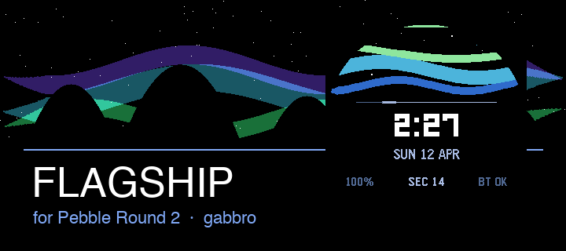

# Aurora — Pebble Watchface

> A premium utility-first watchface with an aurora borealis visual design.

<br>




<br>

### Live on device

| Pebble Time 2 &nbsp;·&nbsp; `emery` | Pebble Round 2 &nbsp;·&nbsp; `gabbro` |
| :---: | :---: |
|  |  |
| 200 × 228 px · rectangular | 260 × 260 px · round |

<br>

## What It Does

Aurora surfaces the information you actually glance at — time, date, battery, and connection — inside a layered aurora landscape that shifts with the time of day.

- **Animated aurora** — three sine-wave bands (violet → teal → green) that flow in real time
- **Star field** with subtle per-second twinkling
- **Mountain silhouette** with snow caps on rectangular displays
- **Second-sweep pulse** — an accent line that travels across the divider each minute
- **Time-of-day accent colours** — amber at morning, sky blue by day, cool violet at night
- **Full status row** — battery %, live seconds, Bluetooth state
- **12 h / 24 h** — auto-detected from watch settings
- **Scaled families** — Time / Time Steel (`basalt`), Time Round (`chalk`), Pebble 2 (`diorite`), Pebble 2 Duo (`flint`), Time 2 (`emery`), Round 2 (`gabbro`)

<br>

## Quick Start

```bash
cd watchfaces/aurora

# Run native logic tests (no Pebble SDK required)
npm run test:native

# Build
/Users/nyinyizaw/.local/bin/pebble build

# Install to emulator
/Users/nyinyizaw/.local/bin/pebble install --emulator emery build/aurora.pbw
/Users/nyinyizaw/.local/bin/pebble install --emulator gabbro build/aurora.pbw
```

<br>

## Architecture

Aurora now runs as a native Pebble C watchface:

```
src/c/
├── main.c              Pebble layers, drawing, battery/Bluetooth/tick subscriptions
├── aurora_logic.c      platform-agnostic C logic
└── aurora_logic.h
```

Tests run through a small host-native C harness:

```bash
npm run test:native
```

<br>

## Rendering Pipeline

Every second (`secondchange` event) the watchface redraws in this order:

1. Black background
2. Star field — twinkling offset cycles every 5 s
3. Aurora bands × 3 — phases driven by `secondProgress` for fluid motion
4. Mountain silhouette + snow caps *(rectangular only)*
5. Accent divider line
6. Second-sweep pulse along divider
7. Time — Leco 42 px LCD digits
8. Meridiem (AM / PM) *(12 h mode only)*
9. Date — compact uppercase `SUN 12 APR`
10. Status row — `100%  ·  SEC 34  ·  BT OK`
11. Battery indicator bar *(top edge, colour-coded)*

<br>

## Project Structure

```
watchfaces/aurora/
├── src/c/               native Pebble implementation
├── tests/               host-side C logic tests
├── screenshots/         store assets (screenshots + banners)
└── build/               generated — aurora.pbw lives here
```

<br>

## Building from Source

You need [Pebble SDK v4.9](https://developer.repebble.com/) with the CLI available on your `PATH`.

```bash
/Users/nyinyizaw/.local/bin/pebble build                              # produces build/aurora.pbw
/Users/nyinyizaw/.local/bin/pebble install --emulator emery build/aurora.pbw
/Users/nyinyizaw/.local/bin/pebble install --emulator gabbro build/aurora.pbw
/Users/nyinyizaw/.local/bin/pebble screenshot --no-open --emulator emery emery.png
/Users/nyinyizaw/.local/bin/pebble logs --emulator emery
```
